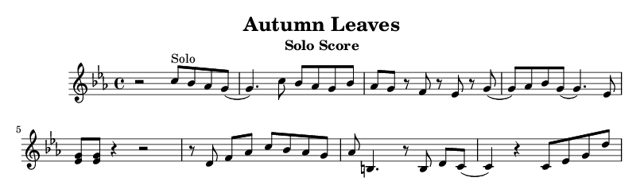

吹奏楽部でソロをもらったのですが、本来はピアノがソロを担当する曲なのでサックスの譜面がなく、しかたなく書くことになりました。

> LilyPond は、可能な限り高品位な楽譜を生み出すことを目的とする、オープン ソースの楽譜作成プログラムです。このフリー ソフトウェアは、伝統的な彫版の楽譜の美しさをコンピュータ プリントアウトで実現します。LilyPond はフリーソフトウェアであり、GNU プロジェクト の一部です。
>  - <http://lilypond.org/index.ja.html>

<!--more-->

GNUらしく公式サイトでは自由が強調されています。GNUのサイトはデザインこそカッコイイとはいい難いものの、どれも目にやさしく見やすいので私は好きです。

「高品位な」と言っているだけあって、無調整でもなかなか美しい楽譜を作ることが出来ました。
LilypondはTeX同様、テキストからpdfを出力します、なのでバージョン管理もできますし、好きなエディターで編集することもできます、そしてMusiXTeXと比べ非常に簡単に扱う事ができます。

弱点といいますか、WYSIWYGではないので間違いを見つけたときに書き直す箇所をみつけるのが大変でした、それ以外はまったく問題ありませんでした。

## 環境を整える

わたしはVimで楽譜を書きたかったので、Vimに[matze/vim-lilypond](https://github.com/matze/vim-lilypond)を追加しました。

## 楽譜を書く 

Lilypondは容易に使用できるにかかわらず非常に強力です、以下に<http://lilypond.org/examples.ja.html>からの例を載せておきます。


[公式サイトのリファレンス](http://lilypond.org/doc/v2.18/Documentation/learning/index.ja.html)が充実しているので、それを読めば楽譜はひととおり書けるでしょう。

[チートシート](http://lilypond.org/doc/v2.18/Documentation/notation/cheat-sheet)も用意されています。

この説明だけでは味気ないので、すこしだけサンプルコードを載せておきます。

```lilypond
\version "2.18.2"
{
  c' e' g' e'
}
```

以上のコードで


のような譜面ができます。ひとつずつ解説しましょう。

- 楽譜の目には見えない部分の設定は、`\hoge`でおこないます。`\version`はLilypondのバージョンを指定しています。
- 楽譜本体は`{`と`}`で囲みます。
- 音の指定はコードで指定します。`a`から`g`までで`h`は存在しません。小文字です。
- コードの後の`'`は1オクターブ上の音、という意味です。

```lilypond
\version "2.18.2"

\relative c' {
  c' c' c' c' | c' c' c' c' | c, c, c, c, | c, c, c, c,
}
```


- `\relative`で相対的に記述を行うことができます。
- `|`で小節を明示的に区切ることができます。自動でも区切られますが、あえて示す事によって一小節に音が足りない場合を検知してくれるのでミスが減ります。

```lilypond
\version "2.18.2"

\relative c' {
  \key f \major
  c' r2 d,4 | r4. d8 c4 a
}
```


- 音の後の数字で長さを指定します。
- `\key`で調を指定しています。
- `r`で休符です。

```lilypond
\version "2.18.2"

\relative c'' {
  a b c d | <a b> <a b> <a b> <a b>( | <a b c d e>1)~ | <a b c d e>1
}
```


- `<`と`>`で囲んだ範囲が和音になります。
- `(`と`)`で囲んだ範囲がスラーになります。
- `~`を付けると後の音とのタイになります。

```lilypond
\version "2.18.2"

\relative c'' {
    c4-^\p c-+\pp c--\f c-!\ff | c4-> c-. c2-_
  | a\< b\! c d\> | e1
}
```


- 各アーテュキレーションも付ける事ができます。
- `\!`でクレセンド、デクレセンドの終端になります。

<!-- 誤りを発見
最後に、わたしの実際に書いたコードの断片を紹介します。

```lilypond
\version "2.18.2" 

\header { 
 title = \markup \center-align { "Autumn Leaves" } 
 subtitle = \markup \center-align { "Solo Score" } 
} 
\paper { 
	#( set-paper-size "a4" ) 
} 
\transpose c' bes' {
  \relative c' {
    \key f \major
    \time 4/4
      r2 d8^"Solo" c bes a( | a4.) d8 c bes a c | bes a r g r f r a( | a) bes c a( a4.) f8 
    | <f a> <f a> r4 r2 | r8 e g[ bes] d[ c bes a] | bes cis,4. r8 cis e[ d]( | d4) r d8 f a e'
  }
}
```



- `\time 4/4`で四分の四拍子であることを明示。^[この例の場合はしなくても良い]
- `-es`、`-is`でシャープ、フラット
- Cの調の楽譜をBes調の楽譜に起こしたかったので、Cそのままで一度書いたあとに、`\relative c bes`でBesに変換した。
-->

以上です、簡単だったでしょう？さあ、LilyPondをインストールして音楽家になりましょう。

